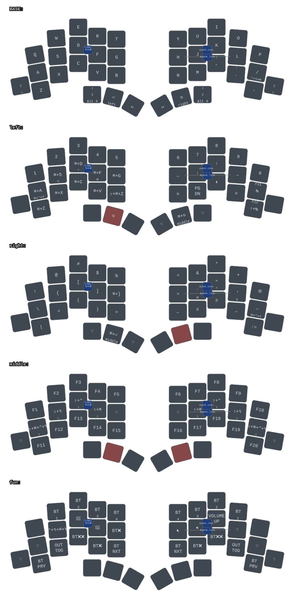

# Keymap

This page is the one hand-written layer and thumb reference. Source of truth
is [`config/totem.keymap`](https://github.com/lilfeelz/zmk/blob/main/config/totem.keymap);
if this page and the keymap disagree, the keymap wins. The diagram below is
generated from the keymap by keymap-drawer on every docs deploy.



## Key positions

Positions are the flat indices ZMK uses in `key-positions` and
`hold-trigger-key-positions`.

```
      0   1   2   3   4       5   6   7   8   9
     10  11  12  13  14      15  16  17  18  19
 20  21  22  23  24  25      26  27  28  29  30  31
             32  33  34      35  36  37
```

Thumbs, left to right: 32 left outer, 33 left middle, 34 left inner,
35 right inner, 36 right middle, 37 right outer.

## Layers

| # | Node | Name | How to reach | Contents |
|---|------|------|--------------|----------|
| 0 | `base` | BASE | default | QWERTY alphas; `/` on 19 (hold: Ctrl+Alt+Cmd); `-` on 30; sticky Shift on 20 and 31 |
| 1 | `left` | NAV | hold left middle thumb (33) | Numbers, arrows, Home/PgDn/PgUp/End, Cmd+letter shortcuts, `cmd_tab`/`cmd_stb` |
| 2 | `right` | SYM | hold right middle thumb (36) | Shifted symbols, brackets, pipe, arrow and comparison macros |
| 3 | `fun` | FUN | hold either outer thumb (32 or 37) | F1 to F12, brightness, volume, mute, output toggle, BT select 0 to 3 (mirrored), BT clear |

FUN in detail:

```
         F1     F2     F3     F4     F5        F6     F7     F8     F9     F10
         out    .      bri-   bri+   .         .      vol-   vol+   mute   out
  F11    BT3    BT2    BT1    BT0    BTclr     BTclr  BT0    BT1    BT2    BT3    F12
```

`out` is `&out OUT_TOG` (USB / BLE output).

## Thumb keys

| Layer | 32 L outer | 33 L middle | 34 L inner | 35 R inner | 36 R middle | 37 R outer |
|-------|------------|-------------|------------|------------|-------------|------------|
| BASE | hold FUN, tap caps word | hold NAV, tap Backspace | Space | Space | hold SYM, tap Esc | hold FUN, tap caps word |
| NAV | none | (held) | none | Space | sticky Shift | hold FUN, tap caps word |
| SYM | hold FUN, tap caps word | sticky Shift | Space | none | (held) | none |
| FUN | (held) | none | none | none | none | (held) |

Bindings behind the BASE thumbs:

- 32, 37: `&lt_caps 3 0`. Hold is `&lt 3`, tap is `&caps` (caps word; with Shift held, Caps Lock).
- 33: `&sk_mo 1 BACKSPACE`. Hold is `&mo 1`, tap is `&sk BACKSPACE`.
- 36: `&lt 2 ESCAPE`.
- NAV 36: `&sk RIGHT_SHIFT`, SYM 33: `&sk LEFT_SHIFT`.

Cells marked "(held)" or inherited from BASE are `&trans` in the keymap.

## Combos

| Name | Positions | Base keys | Layer | Action |
|------|-----------|-----------|-------|--------|
| `enter` | 16 17 | J K | BASE | Enter |
| `bs_df` | 12 13 | D F | BASE | `&bwd_dwd`: Alt+Backspace, with Shift Alt+Delete |
| `bwd` | 11 12 13 | S D F | BASE | Backspace |
| `left_right` | 15 18 | Left Right | NAV | `yank_line` macro |
| `up_down` | 16 17 | Down Up | NAV | `yank_inner_word` macro |

The ASCII diagram in the comment above `base` in `config/totem.keymap` is
stale (QWERTZ letters, old thumb labels). Trust the `bindings`, not the comment.
